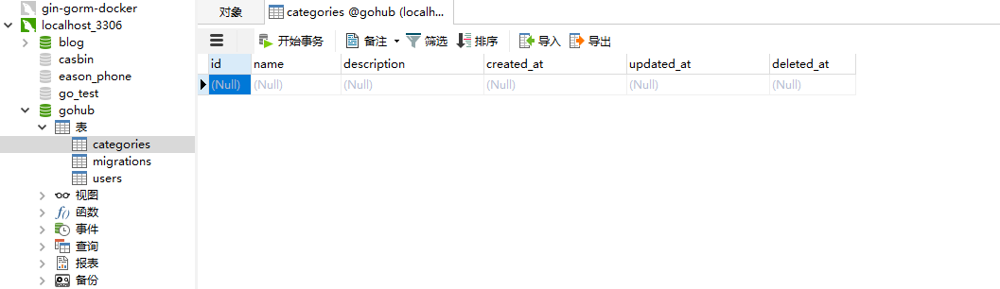
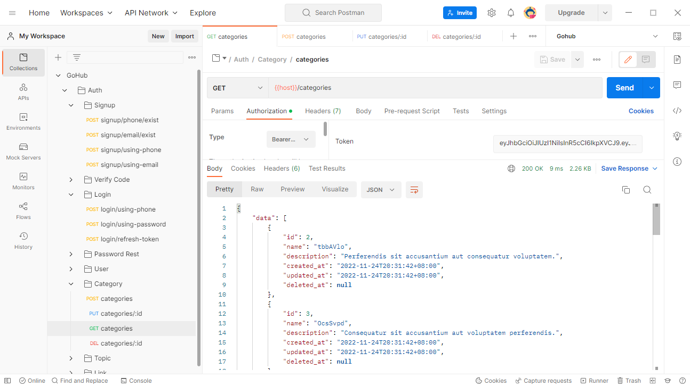
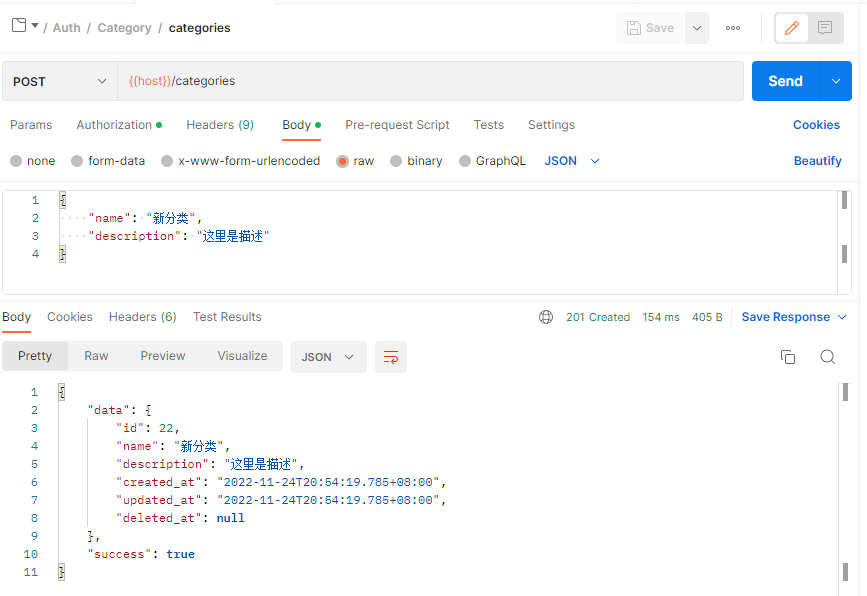
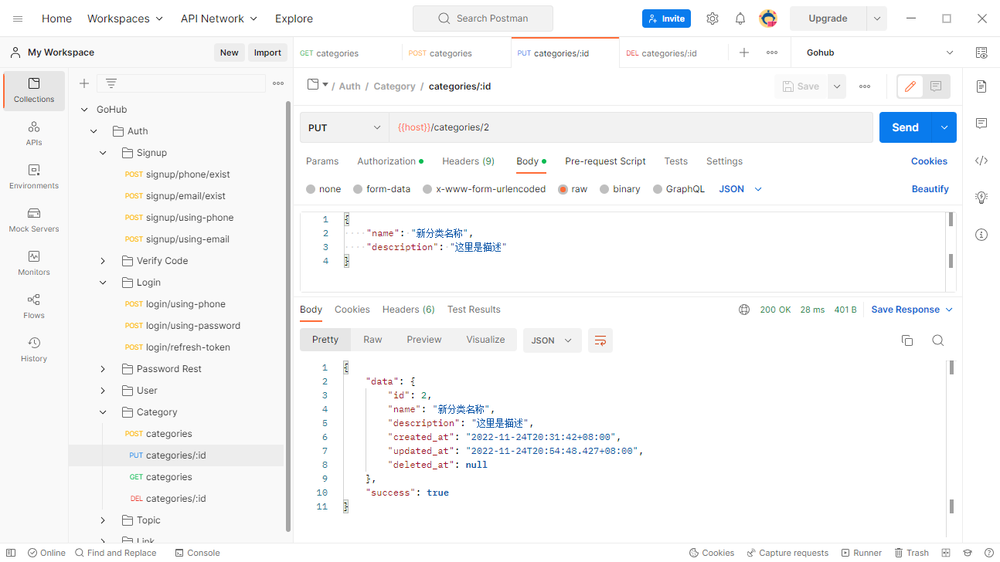
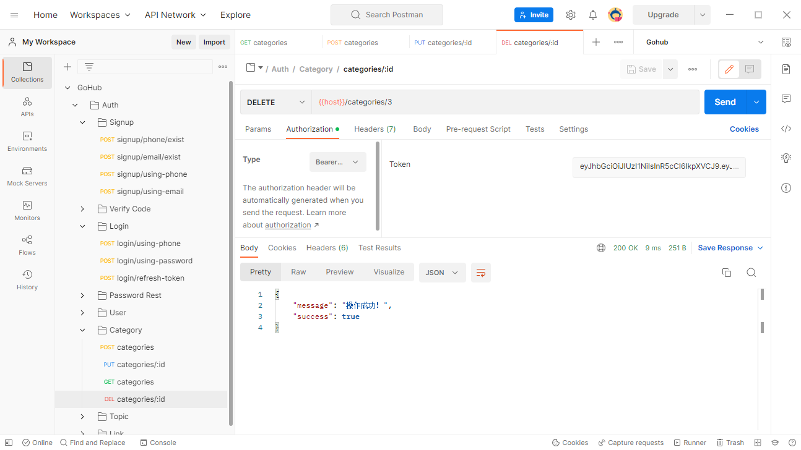

# gin-vue3-admin

- 前端：https://github.com/Gopherlinzy/Vue3-elementplus-admin


# 运行 & 部署

1、克隆项目
```go
git clone github.com/Gopherlinzy/gin-vue3-admin.git
#or
git clone https://github.com/Gopherlinzy/gin-vue3-admin.git
```
2. 进入项目文件夹下
```go
cd Gopherlinzy/gin-vue3-admin
```

3、安装依赖
```go
go mod tidy
```

4、创建并初始化项目配置config.yaml
```go
app:
#  应用名称
  name: "gin-vue3-admin"
#  当前环境，用以区分多环境，一般为 local, stage, production, test
  env: "local"
#  加密会话、JWT 加密
  key: "zBqYyQrPNaIUsnRhsGtHLivjqiMjBVLS"
#  是否进入调试模式
  debug: true
#  用以生成链接
  url: "http://localhost:8888"
#  应用服务端口
  port: "8888"
#  数据库类型:mysql(默认)|sqlite|sqlserver|postgresql
  db-type: "mysql"
#  设置时区，JWT 里会使用，日志记录里也会使用到
  timezone: "Asia/Shanghai"
#  API 域名，未设置的话所有 API URL 加 api 前缀，如 http://domain.com/api/v1/users
  api_domain: ""

log:
#  日志级别，必须是以下这些选项：
#  "debug" —— 信息量大，一般调试时打开。系统模块详细运行的日志，例如 HTTP 请求、数据库请求、发送邮件、发送短信
#  "info" —— 业务级别的运行日志，如用户登录、用户退出、订单撤销。
#  "warn" —— 感兴趣、需要引起关注的信息。 例如，调试时候打印调试信息（命令行输出会有高亮）。
#  "error" —— 记录错误信息。Panic 或者 Error。如数据库连接错误、HTTP 端口被占用等。一般生产环境使用的等级。
#  以上级别从低到高，level 值设置的级别越高，记录到日志的信息就越少
#  开发时推荐使用 "debug" 或者 "info" ，生产环境下使用 "error"
  level: "error"
#  日志的类型，可选：
#  "single" 独立的文件
#  "daily" 按照日期每日一个
  type: "daily"
#  ------------------ 滚动日志配置 ------------------
#  日志文件路径
  filename: "storage/logs/logs.log"
#  每个日志文件保存的最大尺寸 单位：M
  max_size: 64
#  最多保存日志文件数，0 为不限，MaxAge 到了还是会删
  max_backup: 5
#  最多保存多少天，7 表示一周前的日志会被删除，0 表示不删
  max_age: 7
#  是否压缩，压缩日志不方便查看，我们设置为 false（压缩可节省空间）
  compress: false

mysql:
#  服务器地址:
  host: "127.0.0.1"
#  :端口
  port: "3306"
#  数据库名（需要修改）
  database: "xxx"
#  数据库用户名（需要修改）
  username: "xxx"
#  数据库密码 （需要修改）
  password: "xxxxx"
#  数据库编码
  charset: "utf8mb4"
#  空闲中的最大连接数
  max_idle_connections: 100
#  打开到数据库的最大连接数
  max_open_connections: 25
  max_life_seconds: 300

redis:
#  服务器地址:
  host: "127.0.0.1"
# 端口
  port: "6379"
#  用户（需要修改）
  username: ""
# 密码（需要修改）
  password: ""
#  业务类存储使用 1 (图片验证码、短信验证码、会话)
  database: 1
#  缓存 cache 包使用 0 ，缓存清空理应当不影响业务
  database_cache: 1

captcha:
#  验证码图片高度
  height: 80
#  验证码图片宽度
  width: 240
#  验证码的长度
  length: 6
#  过期时间，单位是分钟
  expire_time: 15
#  debug 模式下的过期时间，方便本地开发调试
  debug_expire_time: 10080
#  非 production 环境，使用此 key 可跳过验证，方便测试
  testing_key: "captcha_skip_test"
  digit:
    #  数字的最大倾斜角度
    maxskew: 0.7
    #  图片背景里的混淆点数量
    dotcount: 80
  string:
    source: "0123456789abcdefghjkmnoqrstuvxyz"

verifycode:
#  验证码的长度
  code_length: 6
#  过期时间，单位是分钟
  expire_time: 15

#  debug 模式下的过期时间，方便本地开发调试
  debug_expire_time: 10080
#  本地开发环境验证码使用 debug_code
  debug_code: "123456"

#  方便本地和 API 自动测试
  debug_phone_prefix: "000"
  debug_email_suffix: "@testing.com"
sms:
  aliyun: 
#    秘钥 ID（需要修改）
    access_key_id: xxxx
#    秘钥密码（需要修改）
    access_key_secret: xxx
#    签名（需要修改）
    sign_name: xxxx
#    模板（需要修改）
    template_code: xxxx

#  Mailhog 的配置
mail:
  stmp:
#    服务器地址
    host: "127.0.0.1"
#    端口
    port: "1025"
    username: ""
    password: ""
  from:
#   发送者邮件地址（需要修改）
    address: "xxx"
#   发送人（需要修改）
    name: "xxx"

jwt:
#  过期时间，单位是分钟，一般不超过两个小时
  expire_time: 120
#  允许刷新时间，单位分钟，86400 为两个月，从 Token 的签名时间算起
  max_refresh_time: 86400
#  debug 模式下的过期时间，方便本地开发调试
  debug_expire_time: 86400

paging:
#  默认每页条数
  perpage: 10
#  URL 中用以分辨多少页的参数
#  此值若修改需一并修改请求验证规则
  url_query_page: "page"
#  URL 中用以分辨排序的参数（使用 id 或者其他）
#  此值若修改需一并修改请求验证规则
  url_query_sort: "sort"
#  URL 中用以分辨排序规则的参数（辨别是正序还是倒序）
#  此值若修改需一并修改请求验证规则
  url_query_order: "order"
#  URL 中用以分辨每页条数的参数
#  此值若修改需一并修改请求验证规则
  url_query_per_page: "per_page"
```
# 启动项目
启动前一定要创建数据库，并修改配置文件，数据表会自动创建
```go
go run main.go
```


# 所有命令
```go
$ go run main.go -h
Default will run "serve" command, you can use "-h" flag to see all subcommands

Usage:
  Gohub [command]

Available Commands:
  cache       Cache management
  completion  Generate the autocompletion script for the specified shell        
  help        Help about any command
  key         Generate App Key, will print the generated Key
  make        Generate file and code
  migrate     Run database migration
  play        Likes the Go Playground, but running at our application context   
  seed        Insert fake data to the database
  server      Start web server

Flags:
  -e, --env string   load .env file, example: --env=testing will use .env.testin
g file
  -h, --help         help for Gohub

Use "Gohub [command] --help" for more information about a command.
```

make 命令：
```go
$ go run main.go make -h      
Generate file and code

Usage:
  Gohub make [command]

Available Commands:
  apicontroller Create api controller，exmaple: make apicontroller v1/user      
  cmd           Create a command, should be snake_case, exmaple: make cmd buckup
_database
  factory       Create model's factory file, example: make factory user
  migration     Create a migration file, example: make migration add_users_table
  model         Crate model file, example: make model user
  policy        Create policy file, example: make policy user
  request       Create request file, example make request user
  seeder        Create seeder file, example:  make seeder user

Flags:
  -h, --help   help for make

Global Flags:
  -e, --env string   load .env file, example: --env=testing will use .env.testin
g file

Use "Gohub make [command] --help" for more information about a command.
```

migrate 命令：
```go
$ go run main.go migrate -h   
Run database migration

Usage:
  Gohub migrate [command]

Available Commands:
  down        Reverse the up command
  fresh       Drop all tables and re-run all migrations
  refresh     Reset and re-run all migrations
  reset       Rollback all database migrations
  up          Run unmigrated migrations

Flags:
  -h, --help   help for migrate

Global Flags:
  -e, --env string   load .env file, example: --env=testing will use .env.testin
g file

Use "Gohub migrate [command] --help" for more information about a command. 
```


# 自动化生成CRUD接口

## 1. 创建模型
```shell
$ go run main.go make model category
```

修改下 category_model.go 文件里的模型定义

app/models/category/category_model.go

```go
.
.
.
type Category struct {
    models.BaseModel

    Name        string `json:"name,omitempty"`
    Description string `json:"description,omitempty"`

    models.CommonTimestampsField
}
.
.
.
```

## 2. 创建迁移（数据表）

```shell
$ go run main.go make migration add_categories_table category
```

这里有两个参数一个是生成表，一个是表名

去database/migrations目录下打开生成的 migration 文件，定制表结构：
```go
.
.
.
func init() {

    type Category struct {
        models.BaseModel

        Name        string `gorm:"type:varchar(255);not null;index"`
        Description string `gorm:"type:varchar(255);default:null"`

        models.CommonTimestampsField
    }

    up := func(migrator gorm.Migrator, DB *sql.DB) {
        migrator.AutoMigrate(&Category{})
    }

    down := func(migrator gorm.Migrator, DB *sql.DB) {
        migrator.DropTable(&Category{})
    }
.
.
.
```

## 3. 执行迁移 生成数据表
```shell
$ go run main.go migrate up
```

## 4. 生成数据验证 request 文件
```shell
$ go run main.go make request category
```
修改请求数据结构，以及验证规则和错误：

app/requests/category_request.go
```go
package requests

import (
	"github.com/gin-gonic/gin"
	"github.com/thedevsaddam/govalidator"
)

type CategoryRequest struct {
	Name        string `valid:"name" json:"name"`
	Description string `valid:"description" json:"description,omitempty"`
}

func CategorySave(data interface{}, c *gin.Context) map[string][]string {

	rules := govalidator.MapData{
		"name":        []string{"required", "min_cn:2", "max_cn:8", "not_exists:categories,name"},
		"description": []string{"min_cn:3", "max_cn:255"},
	}
	messages := govalidator.MapData{
		"name": []string{
			"required:名称为必填项",
			"min_cn:名称长度需至少 2 个字",
			"max_cn:名称长度不能超过 8 个字",
			"not_exists:名称已存在",
		},
		"description": []string{
			"min_cn:描述长度需至少 3 个字",
			"max_cn:描述长度不能超过 255 个字",
		},
	}
	return validate(data, rules, messages)
}
```

## 5. 自定义验证规则
我们可以使用自定义验证规则来完善数据验证功能, 这里我们底层使用的验证器 govalidator 虽然支持 min 和 max 来设置字符串长度规则，但是不适用于中文字符串。

所以上面我们使用了 min_cn 和 max_cn 的自定义规则，现在来创建这两个规则：

app/requests/validators/custom_rules.go

```go
.
.
.
// 此方法会在初始化时执行，注册自定义表单验证规则
func init() {
    .
    .
    .
    // max_cn:8 中文长度设定不超过 8
    govalidator.AddCustomRule("max_cn", func(field string, rule string, message string, value interface{}) error {
        valLength := utf8.RuneCountInString(value.(string))
        l, _ := strconv.Atoi(strings.TrimPrefix(rule, "max_cn:"))
        if valLength > l {
            // 如果有自定义错误消息的话，使用自定义消息
            if message != "" {
                return errors.New(message)
            }
            return fmt.Errorf("长度不能超过 %d 个字", l)
        }
        return nil
    })

    // min_cn:2 中文长度设定不小于 2
    govalidator.AddCustomRule("min_cn", func(field string, rule string, message string, value interface{}) error {
        valLength := utf8.RuneCountInString(value.(string))
        l, _ := strconv.Atoi(strings.TrimPrefix(rule, "min_cn:"))
        if valLength < l {
            // 如果有自定义错误消息的话，使用自定义消息
            if message != "" {
                return errors.New(message)
            }
            return fmt.Errorf("长度需大于 %d 个字", l)
        }
        return nil
    })
}
```

## 6. 生成控制器 controller 文件
```shell
$ go run main.go make apicontroller v1/category
```
app/http/controllers/api/v1 目录下生成的 categories_controller.go 里有很多内容。


## 7. 创建工厂, 生成假数据

首先我们来填充一些数据，方便测试分页。

先来创建分类工厂：
```shell
$ go run main.go make factory category
[database/factories/category_factory.go] created.
```
修改内容如下；

database/factories/category_factory.go

```go
.
.
.
func MakeCategories(count int) []category.Category {

    var objs []category.Category

    // 设置唯一性，如 Category 模型的某个字段需要唯一，即可取消注释
    faker.SetGenerateUniqueValues(true)

    for i := 0; i < count; i++ {
        categoryModel := category.Category{
            Name:        faker.Username(),
            Description: faker.Sentence(),
        }
        objs = append(objs, categoryModel)
    }

    return objs
}
```

> 因为分类名称要保持唯一，所以取消了上面的 faker.SetGenerateUniqueValues(true) 的注释。

## 8. 生成 Seed 文件

```go
$ go run main.go make seeder category
[database/seeders/categories_seeder.go] created.
```

文件不用修改

## 9. 填充数据

我们只需要填充 SeedCategoriesTable 即可：
```go
$ go run main.go seed SeedCategoriesTable
Table [categories] 10 rows seeded
```


## 10. 修改控制器文件里的Index方法 (如果数据需要分页)
app/http/controllers/api/v1/categories_controller.go
```go
.
.
.

func (ctrl *CategoriesController) Index(c *gin.Context) {
    request := requests.PaginationRequest{}
    if ok := requests.Validate(c, &request, requests.Pagination); !ok {
        return
    }

	// category 修改为 你的表名
    data, pager := category.Paginate(c, 10)
    response.JSON(c, gin.H{
        "data":  data,
        "pager": pager,
    })
}
```


## 11. 注册路由

在 router/api.go 文件里注册你的刚刚生成的路由

```go
.
.
.
cgc := new(controllers.CategoriesController)
cgcGroup := v1.Group("/categories")
{
cgcGroup.GET("", cgc.Index)
cgcGroup.POST("", middlewares.AuthJWT(), cgc.Store)
cgcGroup.PUT("/:id", middlewares.AuthJWT(), cgc.Update)
cgcGroup.DELETE("/:id", middlewares.AuthJWT(), cgc.Delete)
}
```

需要 Token 验证, 注册或者登录获得 token






# 第三方依赖
- gin —— 路由、路由组、中间件
- zap —— 高性能日志方案
- casbin —— RBAC模型权限认证
- gorm —— ORM 数据操作
- cobra —— 命令行结构
- viper —— 配置信息
- cast —— 类型转换
- redis —— Redis 操作
- jwt —— JWT 操作
- base64Captcha —— 图片验证码
- govalidator —— 请求验证器
- limiter —— 限流器
- email —— SMTP 邮件发送
- aliyun-communicate —— 发送阿里云短信
- ansi —— 终端高亮输出
- strcase —— 字符串大小写操作
- pluralize —— 英文字符单数复数处理
- faker —— 假数据填充
- imaging —— 图片裁切

# 自定义的包
- app —— 应用对象
- auth —— 用户授权
- cache —— 缓存
- captcha —— 图片验证码
- casbin —— 权限认证
- configYaml —— 配置信息
- console —— 终端
- database —— 数据库操作
- file —— 文件处理
- hash —— 哈希
- helpers —— 辅助方法
- jwt —— JWT 认证
- limiter —— API 限流
- logger —— 日志记录
- mail —— 邮件发送
- migrate —— 数据库迁移
- paginator —— 分页器
- redis —— Redis 数据库操作
- response —— 响应处理
- seed —— 数据填充
- sms —— 发送短信
- str —— 字符串处理
- verifycode —— 数字验证码

